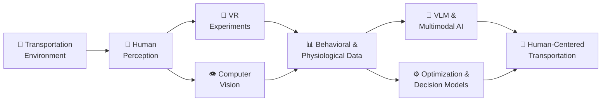

 

---

## 🧭 About Me

<table>
  <tr>
    <td width="62%" valign="top">

I am a **Ph.D. student in Transportation Engineering** at the **University at Buffalo (SUNY)**, advised by **Dr. Austin Valentine Angulo** in the **Transportation Research and Visualization Laboratory (TRAVL Lab)**.

My research focuses on **human behavior and perception in transportation environments**, particularly how **pedestrians and drivers perceive, interpret, and respond to vehicles and surrounding traffic conditions**.

I use **virtual reality, computer vision, physiological sensing, behavioral modeling, and data-driven methods** to study human interactions with transportation systems. I am also interested in applying **Vision–Language Models (VLMs)** and **optimization methods** to transportation scene understanding, behavioral analysis, decision support, and system design.

- 🚶 Studying **pedestrian and driver behavior, perception, and decision-making**
- 🥽 Designing **immersive VR experiments** for transportation research
- 👁️ Applying **Computer Vision** to understand human behavior and traffic environments
- 🧠 Exploring **Vision–Language Models (VLMs)** for scene understanding and behavioral inference
- 📊 Integrating **behavioral, visual, physiological, and transportation data**
- ⚙️ Applying **optimization and operations research methods** to transportation problems
- 🚗 Investigating **human interaction with automated and connected vehicles**
- 📫 Reach me at **[wpark6@buffalo.edu](mailto:wpark6@buffalo.edu)**

    </td>
    <td width="38%" valign="top" align="center">

 

<b>"Understanding people to design better transportation systems."</b>

    </td>
  </tr>
</table>

---

## 🔬 Research Interests

| 🚶 Human Behavior & Perception | 👁️ Computer Vision | 🥽 Virtual Reality |
|:---:|:---:|:---:|
| Understanding how pedestrians and drivers perceive, interpret, and respond to transportation environments | Extracting behavioral and contextual information from transportation imagery and video | Designing controlled immersive experiments to study transportation behavior |

| 🧠 Vision–Language Models | 🚗 Human–Vehicle Interaction | ⚙️ Optimization & Operations Research |
|:---:|:---:|:---:|
| Scene understanding, behavioral analysis, and intent inference using multimodal AI | Studying interactions between people and automated or connected vehicles | Applying mathematical optimization and decision models to transportation systems |

---

## 🧩 Research Framework

  
    Understanding human behavior in transportation through immersive experiments, multimodal sensing, AI, and quantitative decision methods.
  

---

## 🛠️ Languages & Tools

### Programming

### AI / Computer Vision

### VR & Simulation

### Optimization & Data Analysis

### GIS & Design

---

## 🤝 Connect with Me

 

  Transportation · Human Behavior · Computer Vision · Virtual Reality · Multimodal AI · Optimization

